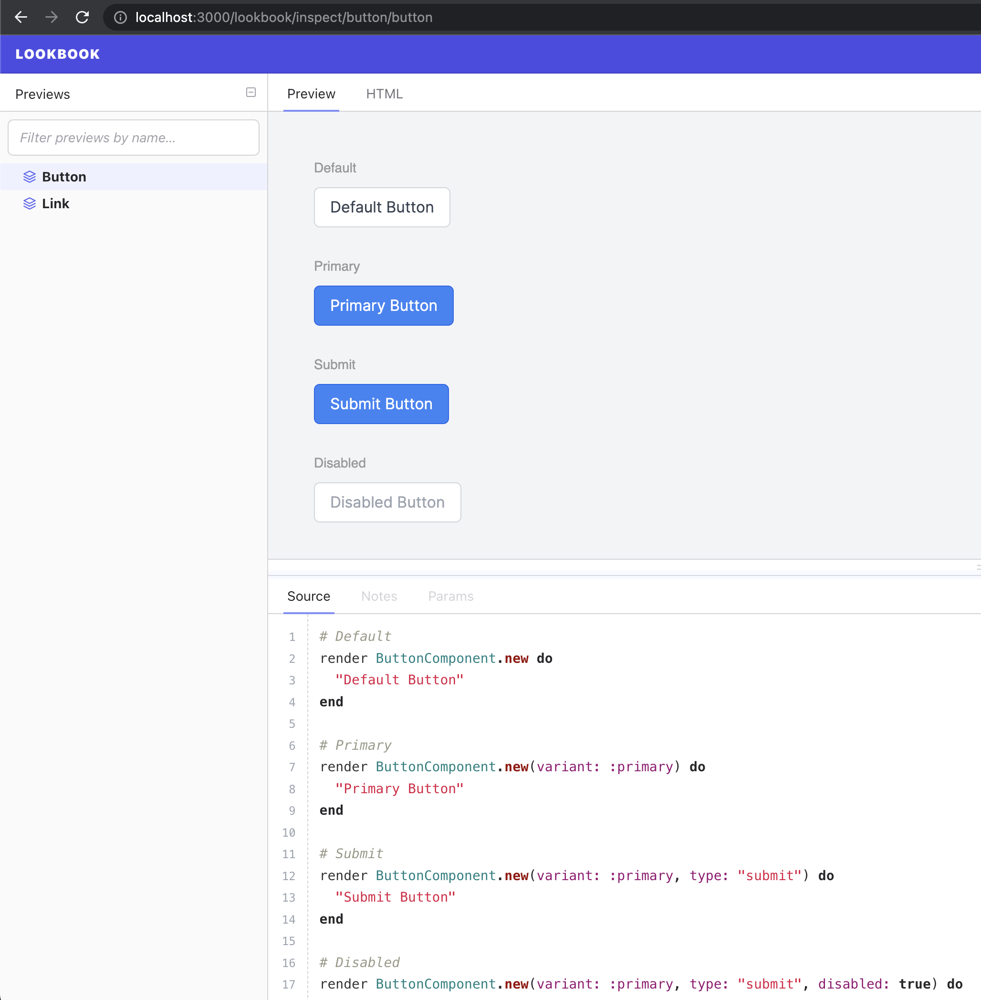

# Rails App Template

My preferred starting point for new Rails 7 apps.

Quick Summary:
- PostgreSQL database
- rspec for tests
- TailwindCSS
- ViewComponents + Lookbook
- Turbo + Stimulus
- importmap (instead of webpacker)
- dotenv for local environment variable configuration
- Setup for your service layer of plain Ruby objects in `app/services/`
- Sidekiq for background jobs
- Dry::Struct with types for immutable and validated Structs
- `bin/cli` runner for ease of adding a Thor-based CLI instead of rake
- `bin/ci` runner for running tests with some options (great locally and for a CI server)
- brakeman for static code analysis to help detect potential security issues
- bundler-audit to ensure you keep your dependencies up to date
- lograge for single-line production environment request logging

I encourage you to read below for options and explanations of each choice.

# Usage

## New apps

### 1. Install Ruby
First, install the latest version of Ruby. At the moment that is 3.1.2. I recommend using RVM, rbenv, or similar and not using your system Ruby.

### 2. Ensure you have the latest version of bundler

See instructions at [bundler.io](https://bundler.io)

If you get the error `uninitialized constant Gem::Source (NameError)` see the troubleshooting section at the end of the README.
This is your indication that you are not currently using the latest version.

### 3. Install PostgreSQL

You can do this however you'd like. Using [homebrew](https://brew.sh/) is very popular, but I prefer [Postgres.app](https://postgresapp.com/)
on my Mac as described below.

Regardless of your installation choice, it's best to get it ready before using this template
so that it can automatically set up your databases for you.

If you do elect to use [Postgres.app](https://postgresapp.com/) to make it easier to manage multiple versions
and have a simple GUI interface to start/stop the server(s). The catch is you need to tell bundler where to find the libraries
it needs to install native extensions for the `pg` gem:

1. Install the app from [Postgres.app](https://postgresapp.com/)
2. Create a new server if there isn't already one listed for Postgres 14 (if using 15 or above just update the version number in all steps)
3. Click the button to initialize the database
4. Click the button to start the server
5. Add the following two lines to your `~/.zshrc` or `~/.bash_profile`
   ```
   export PATH="$PATH:/Applications/Postgres.app/Contents/Versions/14/bin"
   export CONFIGURE_ARGS="with-pg-include=/Applications/Postgres.app/Contents/Versions/14/include"
   ```
6. Close and reopen your terminal or otherwise reload the shell profile
7. Now you can run the generator with this template and `bundle install` later

### 4. Install Redis
We'll use this for background jobs using [Sidekiq](https://sidekiq.org/) and [Turbo Streams](https://turbo.hotwired.dev/handbook/streams)

Using [homebrew](https://brew.sh/)
```
brew install redis
```
```
brew services start redis
```

### 5. Run the new app generator with these values and this template
```
gem install rails
rails new your_new_app_name --database=postgresql --skip-jbuilder --skip-test -skip-bootsnap --css=tailwind -m path/to/this/template.rb
```

## Applying to existing apps

Depending on your app configuration this template may have some conflicts so your mileage may vary, but in general you can use the template with an existing application as well:

(You might need to set up your app with postgres and `tailwindcss-rails` yourself first)

```
cd path/to/your/existing/app/
bin/rails app:template LOCATION=path/to/this/template.rb
```

# Options

## Non-template flags passed to the new app generator

### --database=postgresql 

You can use another database than postgres with template if you'd like. 
I prefer it for many reasons but one in particular is it's performance with json data types using jsonb columns.

If you are using postgres answer 'Y' when asked if you want to overwrite config/database.yml to get a version
that supports quick ENV var configuration. (Also optional if you just want the Rails default)

### --skip-jbuilder 

You can certainly keep `jbuilder` if you'd like, but I find rendering performance gets to be poor fairly quickly. 
This template includes `multi_json` and `oj` for much more performant rendering of JSON from objects and hashes

### --skip-test 

I'm skipping test generation because this template includes and configures `rspec` instead. 
You can remove this flag if you want to have both available.

### -skip-bootsnap 

You can keep `bootsnap` if you'd like as well. I just don't find I get much value from it and occasionally the "magic" of 
it can cause some confusion in debugging.

### --css=tailwind

Some features of this template expect tailwindcss so if you want to use a different CSS library you'll have to scan 
through the app and remove some tailwind configuration.

## Interactive options

These are asked interactively as you apply the template:

1. Ruby version and optional gemset
    - Creates `.ruby-version` and optionally `.ruby-gemset` files. (The latter for use with RVM or similar)
2. Whether or not you want to automatically commit the empty app when the generator is done (`git init` is run regardless)

# Choices and reasoning

## Environment variables

Use of [dotenv](https://github.com/bkeepers/dotenv) lets you more easily configure local environment variables in
`.env` or `.env.development`/`.env.test` files. These are excluded from git by the template.

Note: if you add or change these you must restart your dev server.

## Background jobs

Background jobs are configured for [Sidekiq](https://sidekiq.org/) running on Redis. The 
[ActiveJob](https://edgeguides.rubyonrails.org/active_job_basics.html) interface is used.

**WARNING**: add authorization checks to `config/routes.rb` for the sidekiq web UI at /jobs or remove it from the 
production environment. This isn't configured securely by the template to start because we have no knowledge of your auth
setup, if any.

## Structuring server-side code

### Services/plain old Ruby objects

This template creates an `app/services/` directory for you and sets it up to autoload files here.
While use of this is not enforced in any way it's highly recommended to create service layer for your app out of
plain Ruby objects rather than in any of the standard Rails MVC files. 

It also includes a simple base service class for our other app services to inherit:

```ruby
# app/services/application_service.rb
class ApplicationService

   private
   
   # Set up a tagged logger for each subclass of ApplicationService.
   #
   # Log messages are prefixed with the class name.
   def logger
      @logger ||= Rails.logger.tagged(self.class.name)
   end

end
```

When you create your services inherit from this and add any common code here.

```ruby
# app/services/my_service.rb
class MyService < ApplicationService

   def do_some_work
      logger.info "Some work was done!"
   end

end
```

Most of your app should be plain Ruby objects containing your business logic.
Rails Models should define your database models but not the logic for how they are used.
Rails Controllers should essentially just handle taking parameters to send to your service layer, handle some routing logic,
and set up the response to the user.

This is a large topic on it's own so rather than explain it all here I recommend starting with this talk from
Dave Copeland: https://www.youtube.com/watch?v=CRboMkFdZfg&ab_channel=RubyCentral

### Non-model objects/Structs

Sometimes you need an object that isn't backed by a database. You can use [ActiveModel](https://guides.rubyonrails.org/active_model_basics.html) 
for this if you need some of the features it gives, such as the validation API or other goodies.

However, this approach is not well suited for a lot of circumstances. In particular, let's say you are representing data
from a 3rd party system. The appropriate approach here is to load an immutable version of that data since it is controlled
from a source outside of your application. You also want to make sure you know what structure and format that data is in
and raise an error if anything unexpected happens so that you can triage it proactively.

I like to use the `dry-configurable`, `dry-struct`, and `dry-validation` gems for this.

Example use:

```ruby
# app/models/external_user.rb
class ExternalUser < Dry::Struct
  transform_keys(&:to_sum)
  
  attribute :name, Types::String.optional
  attribute :email, Types::String

  def to_s
    puts "#{self.email} (#{self.name || 'no name given'})"
  end
end
```

```ruby
external_user = ExternalUser.new(email: "jon@example.com", name: "Jon")
puts external_user
# output:
# jon@example.com (Jon)
external_user = ExternalUser.new(email: "jon@example.com")
puts external_user
# output:
# jon@example.com (no name given)
external_user = ExternalUser.new(name: "Jon")
# exception:
# (Dry::Types::MissingKeyError)
# :email is missing in Hash Input
# 
external_user = ExternalUser.new(name: 123.0)
# exception:
# (Dry::Struct::Error)
# 123.0 (Float) has invalid type for :name violates constraints (type?(String, 123.0)failed)
```

## UI

### No React or other single page app JS frameworks

I no longer use or recommend using JavaScript frameworks (like React) to build your entire view layer. For most apps and teams
you'll be more efficient to render most of your view layer server-side and add interactivity from there for a few reasons:

1. The JavasScript dependency ecosystem is a mess and very difficult to keep up to date and secure. This article is more 
relevant than ever 3 years later: https://naildrivin5.com/blog/2019/07/10/the-frightening-state-security-around-npm-package-management.html .
I want as few JavaScript dependencies as possible.
2. You write all of your view layer twice - the second view layer is the API. This might be fine for very large teams that
require and take advantage of specialized skill roles but I doubt any of those are looking to use app templates :)
You need to write both layers, test them in different tools, coordinate their expectations. ERB works just fine to write it once!
3. Too many choices. Frameworks like React require you to make a lot of choices: router? redux? some fancy add on to redux
like thunks or whatever is hot these days? on and on an on... this is just time, mental energy, and maintenance you could
be spending instead on writing actual features in your app.
4. It's hard to stay performant. I'm not saying you can't keep a single page app running well and using few system resources
but again you have to be super intentional about this and configure all sorts of lazy-loading/split packaging/whatever other
nonsense that does not make your app special or unique in any way. Don't waste time on configuration.

### importmaps

Now default in Rails, you can use JavaScript models directly from the browser without transpiling or bundling.
That means no more webpacker configuration pain. Your (hopefully few) JavaScript library dependencies will load in many
smaller files in the browser, which is much more performant on the more modern HTTP/2, and no need for extra JS tooling
or building steps.

[Detailed information on the importmap-rails repo](https://github.com/rails/importmap-rails)

### Turbo + Stimulus

"But I want my app to be modern!" 

Great! You can use [Turbo](https://turbo.hotwired.dev/) in Rails to do almost any thing you'd like without actually needing
to write any JavaScript. It'll submit forms for you using AJAX, stream updates from the server and put them right in your page
and more. Just build the app as if it were submitting everything to the server as a full page reload and then sprinkle in
some specially named elements and attributes and it's now a fully interactive single page app!

OK so sometimes you need a little extra JavaScript to expand that drop-down menu and select all of the checkboxes on a form.
[Stimulus](https://stimulus.hotwired.dev/) has your back with just a few lines of code and promotes nicely de-coupled 
organization of your JavaScript code.

I also recommend a quick look at [tailwindcss-stimulus-components](https://github.com/excid3/tailwindcss-stimulus-components)
For a handful of small, dependency free, and common JS components. (Modals, Tabs, Toggles, Dropdowns, etc.)

See [hotwired.dev](https://hotwired.dev/)

### TailwindCSS

[tailwindcss](https://tailwindcss.com/) is a popular and robust CSS library that allows for rapid and modern styling
directly in your browser. Your app ships with only the CSS you use and nothing more.

**This template adds some configuration to make sure the tailwindcss builder is looking for the classes you are using
in all of the right places.**

My greatest dev hack ever may have been to buy a license to the companion [Tailwind UI](https://tailwindui.com/) examples.
There are dozens of modern and responsive components and full page examples that even the least creative of us can use to
make a gorgeous app very quickly.

### ViewComponents + Lookbook

OK so by now you might be fearing a bunch of unstructured and difficult to test ERB templates and that is a fair concern.

[ViewComponent](https://viewcomponent.org/) provided in this template help you to create easy to test and reuse components.
Similar in principle to the component-based structure of React but rendered from the server using Ruby and ERB.

Examples are plentiful on the [ViewComponent](https://viewcomponent.org/) so I'll skip detailed ones here, but this template
ensures:
1. The Ruby files are auto-loaded from `app/components/`
2. Tailwind is configured to bundle all of the classes you use in your ViewComponents

```ruby
# app/components/button_component.rb
class ButtonComponent < ViewComponent::Base
   attr_reader :bg_class, :text_color_class
   def initialize(kind: nil)
      case kind
      when :primary
         @bg_class = "bg-blue-600"
         @text_color_class = "text-white"
      else
         @bg_class = "bg-gray-200"
         @text_color_class = "text-gray-700"
      end
   end
end
```
```erb
<!-- app/components/button_component.html.erb -->
<button type="button" class="inline-block px-6 py-2.5 <%= bg_class %> <%= text_color_class %> font-medium text-xs leading-tight uppercase rounded shadow-md hover:shadow-lg focus:shadow-lg focus:outline-none focus:ring-0 active:shadow-lg transition duration-150 ease-in-out">
  <%= content %>
</button>
```
```erb
<!-- app/views/example/index.html.erb -->
<%= render ButtonComponent.new(kind: :primary) do %>
  Button Text
<% end %>
```

Test coverage is great for components but they are visual in nature and unit tests aren't a good way to explore what 
these components look like or help develop them. This template includes the [lookbook](https://lookbook.build/) gem
and also sets it up for auto-loading and bundling any included Tailwind CSS files. 

With [lookbook](https://lookbook.build/) you can create pretty simple previews of said components for rapid development
and a central UI library to see components already available in your app.

This template also includes a layout to use in our previews to include tailwind and a light gray background for them to stand out against.

```ruby
# spec/components/previews/button_component_preview.rb
class ButtonComponentPreview < ViewComponent::Preview
   # Provided by this template
   layout "view_component_preview"

   # @!group
   def default
      render ButtonComponent.new do
         "Button"
      end
   end

   def primary
      render ButtonComponent.new(kind: :primary) do
         "Button"
      end
   end
   # @!endgroup
end
```

Now if you visit http://localhost:3000/lookbook you will a preview of your component in two styles:



## Testing

I prefer and am more familiar with [rspec](https://rspec.info/) so that is what is used and configured here.

It also includes [factory_bot](https://github.com/thoughtbot/factory_bot_rails) to use simple factory definitions over fixtures.

If you prefer to use [standard Rails tests](https://guides.rubyonrails.org/testing.html) do not include the `--skip-test`
flag during app generation and update `bin/ci` accordingly to run those instead of `rspec`. It shouldn't hurt anything to have
`rspec` configured but scanning `template.rb` could give you some clues on how to remove it to reduce the app bundle size.

### CI runner

To make it easier to run tests locally and on a CI server you can simply go to the command line and run:

```
bin/ci
```

This will run rspec tests, brakeman, and audit your gems for security updates. Use can use the following to adjust what runs:

```
bin/ci --only brakeman
bin/ci --only bundle-audit
bin/ci --only rspec
bin/ci --no-brakeman
bin/ci --no-bundle-audit
bin/ci --no-rspec
```

To define a new step in the CI flow edit the `STEPS` in `bin/ci`

#### Security features

Using the ci runner will ensure:
- Tests fail if you have a security issue with a gem version in your app, via [bundler-audit](https://github.com/rubysec/bundler-audit)
- Tests fail if you have a potentially security flaw in your app based on static analysis, via [Brakeman](https://brakemanscanner.org/)

## Command line

You may sometimes need to write some task to be executed by the command line. Rather than using `rake`, I much prefer 
to use [thor](http://whatisthor.com/) for powerful options parsing quick documentation.

Included is a `bin/cli` runner to make it super easy to create your app's command line interface. Just add subcommands in
`templates/cli/name_of_your_subcommand.rb` following the example below, which for convenience is also added by the template 
for you to edit/replace/always have on hand as an example:

```ruby
# app/cli/example_subcommand.rb
class ExampleSubcommand < Thor
   desc "example", "Show an example command"
   long_desc <<~LONGDESC
    Show an example command
        
    Pass --verbose to print detailed information as the command runs.
   LONGDESC
   option :verbose, type: :boolean, default: false
   def example
      verbose = options[:verbose]
      puts "Hello, world!#{verbose ? ' Verbose version.': ''}"
   end
end
```

```ruby
# bin/cli

# Add the following above the `def self.exit_on_failure?` definition:

desc "example SUBCOMMAND", "Example commands"
subcommand "example", ExampleSubcommand
```

Now you can run the nicely documented example command with various options from your app's root directory:

Help on available command options:
```
> bin/cli example --help
Commands:
  cli example hello           # Show an example command
  cli example help [COMMAND]  # Describe subcommands or one specific subcommand
```
Run with default options:
```
> bin/cli example hello
Hello, world!
```
Run with specified options:
```
> bin/cli example hello --verbose
Hello, world! Verbose version
```
Run with specified options (negative version):
```
> bin/cli example hello --no-verbose
Hello, world!
```

# Extra configurations

## Database

If you confirmed you are using PostgreSQL, your  `config/database.yml` was updated to be pre-configured for ENV var use 
(unless you also said no when asked to overwrite the Rails-provided one.)

The variables and defaults are below:
```
RAILS_MAX_THREADS=5
DATABASE_PORT=5432
DATABASE_NAME_DEVELOPMENT=[your_app_name_here]_development
DATABASE_NAME_TEST=[your_app_name_here]_test
DATABASE_NAME_PRODUCTION=[your_app_name_here]_production
DATABASE_USERNAME=[your_app_name_here]
DATABASE_PASSWORD=[your_app_name_here]
```

To adjust these values you can add them to a file named `.env` and reboot your dev server.

Note: if you use something like Heroku this configuration may be ignored in production in favor of a `DATABASE_URL` env var.

A migration was also added to enable UUID primary key support for Postgres. I prefer UUID primary keys for many reasons:
- You don't give away any of your business secrets (for example, incremental integer Order IDs make it really easy for 
competitors to guess how many orders you have processed so far.)
- If you move to multiple apps and databases you are still unlikely to have primary key collision
- It's very hard to move from integer IDs to UUID later

To use them just use the standard ActiveRecord params, for example passing it to `create_table`:

``` ruby
class CreateUsers < ActiveRecord::Migration[7.0]
  def change
    create_table :users, id: :uuid do |t|
      t.string :auth0_id, null: false
      t.timestamps
    end
  end
end
```

And then later in another model as a forgeign key:

```ruby
class CreateBookmarks < ActiveRecord::Migration[7.0]
  def change
    create_table :bookmarks, id: :uuid do |t|
      t.belongs_to :user, foreign_key: true, type: :uuid
      t.string :url
    end
  end 
end
```

You won't need to add any special params to your models when using `belongs_to` there.

# Other suggestions

A few things that don't require any configuration in your app (so aren't in this template) but that I've found useful.

## Heroicons

No great UI is complete without some beautiful icons. I love to use [heroicons](https://heroicons.com/) for UI elements
and [Simple Icons](https://simpleicons.org/) when I needed to use a brand/logo.

## overmind

You'll need two processes to boot the app for development that are defined in `Procfile.dev`. You can use the popular 
[Foreman](https://github.com/ddollar/foreman) gem for this but my preference is to use the more powerful
[overmind](https://github.com/DarthSim/overmind). 

On a Mac:
```
brew install overmind
cd your_new_app_name/
overmind start -f Procfile.dev
```

# Troubleshooting

## Always scan the generator output for issues!

Be sure to scan all of the output for any stack traces with errors.
The generator can keep going after an issue that will cause your app to be unusable!
You can always remove new apps and start again. For existing apps be sure you have committed everything to version
control and/or made a backup.

## uninitialized constant Gem::Source (NameError)

The active version of bundler is not the latest and you need to upgrade. 

One quick and cheap way to do this if you're setting up a new app is:

```
cd your_new_app_name/
bundle update --bundler
cd ..
rm -rf your_new_app_name/
```
Then run the `rails new` command again

For existing apps and other setups find instructions at [bundler.io](https://bundler.io)

# TODO
- [ ] Capybara specs
- [ ] scan template.rb for comments suggesting other features
- [ ] optional auth
- [ ] bugsnag